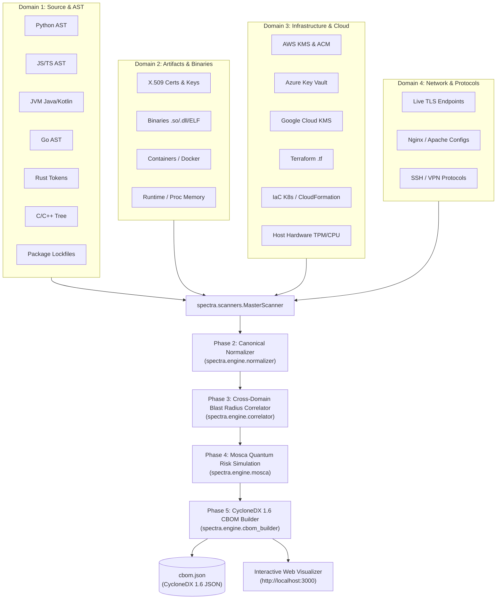

# SPECTRA: System for Post-Quantum Encryption, Cryptography with TRacing & Analysis

[](https://cyclonedx.org)
[](https://csrc.nist.gov)
[](#mosca-quantum-risk-simulation-engine)
[](#domain-3-infrastructure--multi-cloud-key-management)
[](#domain-1-source-code--ast-analysis)

SPECTRA is an enterprise-grade cryptographic static and dynamic reconnaissance platform. It unifies code-level Abstract Syntax Tree (AST) analysis, compiled binary inspection, container/filesystem artifact discovery, multi-cloud key management (AWS KMS, Azure Key Vault, Google Cloud KMS), Infrastructure-as-Code (Terraform, CloudFormation, Kubernetes), and live network TLS protocol audits into a canonical **CycloneDX 1.6 Cryptographic Bill of Materials (CBOM)**.

Spectra evaluates every discovered cryptographic primitive against **Mosca's Inequality** ($X + Y > Z$) across multiple quantum threat horizons, categorizing assets by Shor vulnerability, NIST PQC migration targets (FIPS 203 ML-KEM, FIPS 204 ML-DSA, FIPS 205 SLH-DSA), and blast-radius call depth.

---

## Architecture & Reconnaissance Pipeline

Spectra operates across five sequential analysis phases:



---

## Comprehensive Python Module Inventory

Every Python module in Spectra is systematically categorized below with its exact file path, LOC, class definitions, and detailed architectural purpose.

### 1. Root Application & Orchestration Layer

#### [`spectra/__init__.py`](file:///C:/Users/Arnesh/spectra/spectra/__init__.py)
- **Role**: Top-level package initializer.
- **Purpose**: Defines package metadata, version string (`v1.0.0`), and exposes public programmatic access to the `MasterScanner` and `CryptoAnalysisEngine`.

#### [`spectra/cli.py`](file:///C:/Users/Arnesh/spectra/spectra/cli.py)
- **Role**: Interactive Terminal User Interface (TUI) and CLI Controller.
- **Classes / Functions**: `app`, `_is_server_listening`, `_ensure_visualizer_running`, `_render_hero_banner`, `_render_step_card`, `_render_preflight_dashboard`, `scan`, `_print_findings_summary`, `_print_quantum_risk_summary`.
- **Purpose**: Guides operators through scan boundaries (filesystem target, exclusions, domain scanner matrix). Renders real-time Rich tables for discovered files, runs the 5-phase reconnaissance and analysis pipeline, displays executive KPI metric cards, and automatically spawns the background web visualizer server at `http://localhost:3000`.

#### [`spectra/config.py`](file:///C:/Users/Arnesh/spectra/spectra/config.py)
- **Role**: Pydantic Configuration Model Framework.
- **Classes**: `ScanTargets`, `ScannerToggles`, `SourceScannerConfig`, `NetworkConfig`, `AWSConfig`, `AzureConfig`, `GCPConfig`, `MoscaConfig`, `OutputConfig`, `ScanConfig`.
- **Purpose**: Provides strongly-typed configuration schemas for the entire engine. Auto-detects local cloud credentials for AWS (`~/.aws`), Azure (`~/.azure`), and GCP (`gcloud` CLI / ADC), resolving active session regions (e.g. `ap-southeast-2`) and subscription IDs dynamically.

---

### 2. Domain 1: Source Code & AST Analysis (`spectra/scanners/source`)

#### [`spectra/scanners/source/__init__.py`](file:///C:/Users/Arnesh/spectra/spectra/scanners/source/__init__.py)
- **Classes**: `SourceScanOrchestrator`
- **Purpose**: Coordinates language-specific AST scanners and dependency analyzers. Implements a high-throughput ripgrep candidate filter (`_run_ripgrep_filter`) to bypass non-cryptographic source code, reducing tree-parsing overhead by over 80%.

#### [`spectra/scanners/source/base.py`](file:///C:/Users/Arnesh/spectra/spectra/scanners/source/base.py)
- **Classes**: `SourceFinding`, `BaseSourceScanner`
- **Purpose**: Defines the abstract base contract for source AST scanners across all languages. Encapsulates source findings with file paths, line numbers, code snippets, algorithm names, primitives, key sizes, modes, and quantitative call metrics (direct calls $X$, transitive calls $Y$, LOC).

#### [`spectra/scanners/source/rules.py`](file:///C:/Users/Arnesh/spectra/spectra/scanners/source/rules.py)
- **Classes**: `AlgorithmRule`, `LibraryCallPattern`, `LibraryRule`, `RuleEngine`
- **Purpose**: Loads and parses external YAML rule catalogs (`algorithms.yaml`, `libraries_*.yaml`). Compiles regular expressions for method calls, import signatures, and parameter sets to match cryptographic primitives deterministically.

#### [`spectra/scanners/source/dependency_scanner.py`](file:///C:/Users/Arnesh/spectra/spectra/scanners/source/dependency_scanner.py)
- **Classes**: `DependencyScanner`
- **Purpose**: Audits dependency manifests and lockfiles across 7 package manager formats:
  - Node.js: `package.json`, `package-lock.json`
  - Java / Kotlin: `pom.xml`, `build.gradle`, `build.gradle.kts`, `gradle.lockfile`
  - Rust: `Cargo.toml`, `Cargo.lock`
  - Go: `go.mod`, `go.sum`
  - Python: `requirements.txt`, `Pipfile.lock`, `poetry.lock`
  - C / C++: `vcpkg.json`, `conanfile.txt`
  - .NET: `packages.config`, `.csproj`
  Flags vulnerable cryptographic dependencies (e.g. `crypto-js`, `bouncycastle`, `tink`, `ring`, `aes-gcm`).

#### [`spectra/scanners/source/dependency_analyzer.py`](file:///C:/Users/Arnesh/spectra/spectra/scanners/source/dependency_analyzer.py)
- **Classes**: `DependencyAnalyzer`
- **Purpose**: Resolves call graphs between first-party business code and imported third-party cryptographic packages. Detects whether an imported library's cryptographic functions are actually invoked in the AST or remain unused.

#### [`spectra/scanners/source/python_scanner.py`](file:///C:/Users/Arnesh/spectra/spectra/scanners/source/python_scanner.py)
- **Classes**: `CryptoASTVisitor`, `PythonASTScanner`
- **Purpose**: Utilizes Python's native `ast` module to visit call trees. Audits `cryptography` (Fernet, Hazelmat, AES-GCM, RSA), `hashlib`, `hmac`, `Crypto.Cipher`, `paramiko`, and `bcrypt`, extracting cipher modes (CBC, GCM, CTR) and key lengths.

#### [`spectra/scanners/source/js_ts_scanner.py`](file:///C:/Users/Arnesh/spectra/spectra/scanners/source/js_ts_scanner.py)
- **Classes**: `JSTSSParser`
- **Purpose**: Scans JavaScript and TypeScript source files for Node.js `crypto`, WebCrypto API, `jose`, `jsonwebtoken`, and `crypto-js`. Resolves symmetric ciphers, HMAC digests, and WebCrypto `SubtleCrypto.generateKey()` parameters.

#### [`spectra/scanners/source/jvm_scanner.py`](file:///C:/Users/Arnesh/spectra/spectra/scanners/source/jvm_scanner.py)
- **Classes**: `JVMScanner`
- **Purpose**: Scans Java and Kotlin source code. Parses Java Cryptography Architecture (JCA/JCE) factories (`Cipher.getInstance("AES/GCM/NoPadding")`, `KeyPairGenerator.getInstance("RSA")`), Bouncy Castle Post-Quantum primitives (Dilithium, Kyber), and Google Tink AEAD configurations.

#### [`spectra/scanners/source/go_scanner.py`](file:///C:/Users/Arnesh/spectra/spectra/scanners/source/go_scanner.py)
- **Classes**: `GoScanner`
- **Purpose**: Scans Go source code targeting `crypto/*` packages (`crypto/aes`, `crypto/rsa`, `crypto/ecdsa`, `crypto/ed25519`, `crypto/tls`) and Cloudflare CIRCL PQC libraries (`circl/kem/kyber768`, `circl/sign/dilithium`).

#### [`spectra/scanners/source/rust_scanner.py`](file:///C:/Users/Arnesh/spectra/spectra/scanners/source/rust_scanner.py)
- **Classes**: `RustScanner`
- **Purpose**: Scans Rust source files for crate invocations including `ring` (`signature::ED25519`, `aead::AES_256_GCM`), `aes-gcm`, `rsa`, and `pqcrypto` crates (ML-KEM/Kyber).

#### [`spectra/scanners/source/cpp_scanner.py`](file:///C:/Users/Arnesh/spectra/spectra/scanners/source/cpp_scanner.py)
- **Classes**: `CPPScanner`
- **Purpose**: Scans C and C++ source code and headers (`.c`, `.cpp`, `.h`, `.hpp`). Identifies OpenSSL EVP cipher engines (`EVP_aes_256_gcm()`, `EVP_PKEY_RSA`), libsodium functions, and Open Quantum Safe (`liboqs`) C/C++ wrappers.

---

### 3. Domain 2: Cryptographic Artifacts & Binaries (`spectra/scanners/artifacts`)

#### [`spectra/scanners/artifacts/__init__.py`](file:///C:/Users/Arnesh/spectra/spectra/scanners/artifacts/__init__.py)
- **Classes**: `ArtifactScanOrchestrator`
- **Purpose**: Coordinates filesystem inspection for compiled binaries, static certificates, private keys, container manifests, and dynamic process runtime artifacts.

#### [`spectra/scanners/artifacts/cert_scanner.py`](file:///C:/Users/Arnesh/spectra/spectra/scanners/artifacts/cert_scanner.py)
- **Classes**: `CertFinding`, `CertScanner`
- **Purpose**: Inspects cryptographic certificates and private keys on disk (`.pem`, `.crt`, `.key`, `.der`, `.p12`, PKCS#12 keystores). Extracts issuer/subject CNs, key algorithms (RSA, ECDSA, Ed25519), key sizes, expiration dates, and flags expired certificates and weak keys (<2048-bit RSA).

#### [`spectra/scanners/artifacts/binary_scanner.py`](file:///C:/Users/Arnesh/spectra/spectra/scanners/artifacts/binary_scanner.py)
- **Classes**: `BinaryFinding`, `BinaryScanner`
- **Purpose**: Inspects compiled executable binaries and dynamic libraries (`.exe`, `.dll`, `.so`, `.dylib`, ELF). Extracts exported symbol tables, dynamically linked crypto libraries (e.g. `libssl.so`, `libcrypto.so`, `liboqs.so`), and embedded cryptographic constant strings.

#### [`spectra/scanners/artifacts/container_scanner.py`](file:///C:/Users/Arnesh/spectra/spectra/scanners/artifacts/container_scanner.py)
- **Classes**: `ContainerFinding`, `ContainerScanner`
- **Purpose**: Audits `Dockerfile`, `docker-compose.yml`, and `*.containerfile` configurations. Discovers embedded secrets, hardcoded private keys copied into images, and base image cryptographic packages.

#### [`spectra/scanners/artifacts/runtime_scanner.py`](file:///C:/Users/Arnesh/spectra/spectra/scanners/artifacts/runtime_scanner.py)
- **Classes**: `UnixHTTPConnection`, `RuntimeFinding`, `RuntimeScanner`
- **Purpose**: Connects to the local Docker daemon socket or inspects host process tables. Examines running container environments, mounted volume keys, and active process cryptographic modules.

---

### 4. Domain 3: Infrastructure & Multi-Cloud Key Management (`spectra/scanners/infrastructure`)

#### [`spectra/scanners/infrastructure/__init__.py`](file:///C:/Users/Arnesh/spectra/spectra/scanners/infrastructure/__init__.py)
- **Classes**: `InfrastructureScanOrchestrator`
- **Purpose**: Coordinates multi-cloud and infrastructure reconnaissance. Dispatches scanners across Terraform, IaC manifests, host hardware, AWS, Azure, and GCP, emitting live telemetry callbacks to the interactive CLI table.

#### [`spectra/scanners/infrastructure/aws_scanner.py`](file:///C:/Users/Arnesh/spectra/spectra/scanners/infrastructure/aws_scanner.py)
- **Classes**: `AWSFinding`, `AWSScanner`
- **Purpose**: Audits Amazon Web Services (AWS) cryptographic assets using `boto3`. Discovers AWS KMS Customer Managed Keys (CMKs) and ACM Certificates. Detects active AWS region (e.g. `ap-southeast-2`), evaluates key specs (`SYMMETRIC_DEFAULT`, `RSA_2048`, `ECC_NIST_P256`), checks annual key rotation compliance, and flags Shor vulnerability.

#### [`spectra/scanners/infrastructure/azure_scanner.py`](file:///C:/Users/Arnesh/spectra/spectra/scanners/infrastructure/azure_scanner.py)
- **Classes**: `AzureFinding`, `AzureScanner`
- **Purpose**: Audits Microsoft Azure cryptographic assets using `azure-mgmt-keyvault` and `azure-keyvault-keys`. Auto-resolves active subscription IDs, inspects Key Vaults, extracts JSON Web Key (JWK) cryptographic parameters (`jwk.n`, `jwk.crv`), evaluates key lifecycles, and silences verbose HTTP pipeline wire logging.

#### [`spectra/scanners/infrastructure/gcp_scanner.py`](file:///C:/Users/Arnesh/spectra/spectra/scanners/infrastructure/gcp_scanner.py)
- **Classes**: `GCPFinding`, `GCPScanner`
- **Purpose**: Audits Google Cloud Platform (GCP) Cloud KMS cryptographic assets. Discovers KeyRings across locations (`global`) and CryptoKeys via Google Cloud SDK / Application Default Credentials. Maps `GOOGLE_SYMMETRIC_ENCRYPTION`, `RSA_SIGN_PKCS1_2048`, and `EC_SIGN_P256` to canonical quantum risk profiles.

#### [`spectra/scanners/infrastructure/terraform_scanner.py`](file:///C:/Users/Arnesh/spectra/spectra/scanners/infrastructure/terraform_scanner.py)
- **Classes**: `TerraformFinding`, `TerraformScanner`
- **Purpose**: Parses HashiCorp Terraform (`.tf`) files for cryptographic resources: `aws_kms_key`, `azurerm_key_vault_key`, `google_kms_crypto_key`, `tls_private_key`, and `tls_self_signed_cert`.

#### [`spectra/scanners/infrastructure/iac_scanner.py`](file:///C:/Users/Arnesh/spectra/spectra/scanners/infrastructure/iac_scanner.py)
- **Classes**: `IaCFinding`, `IaCScanner`
- **Purpose**: Parses Kubernetes YAML manifests (`Secret`, `Ingress` TLS termination) and AWS CloudFormation templates (`AWS::KMS::Key`, `AWS::CertificateManager::Certificate`).

#### [`spectra/scanners/infrastructure/hardware_scanner.py`](file:///C:/Users/Arnesh/spectra/spectra/scanners/infrastructure/hardware_scanner.py)
- **Classes**: `HardwareFinding`, `HardwareScanner`
- **Purpose**: Inspects host cryptographic hardware modules: Trusted Platform Module (TPM 2.0 via `/dev/tpmrm0` or WMI), PKCS#11 hardware security modules (HSMs), and CPU cryptographic acceleration flags (`aes`, `sha_ni`, `avx512`).

---

### 5. Domain 4: Network Protocols & TLS Perimeter (`spectra/scanners/network`)

#### [`spectra/scanners/network/__init__.py`](file:///C:/Users/Arnesh/spectra/spectra/scanners/network/__init__.py)
- **Classes**: `NetworkScanOrchestrator`
- **Purpose**: Orchestrates network perimeter reconnaissance against live endpoints, web server configs, and protocol definitions.

#### [`spectra/scanners/network/endpoint_scanner.py`](file:///C:/Users/Arnesh/spectra/spectra/scanners/network/endpoint_scanner.py)
- **Classes**: `NetworkEndpointFinding`, `EndpointScanner`
- **Purpose**: Performs live TCP/TLS handshakes against remote hosts (`host:port`). Negotiates supported TLS protocol versions (TLS 1.0, 1.1, 1.2, 1.3), cipher suites, elliptic curves, and ALPN protocols.

#### [`spectra/scanners/network/nginx_scanner.py`](file:///C:/Users/Arnesh/spectra/spectra/scanners/network/nginx_scanner.py)
- **Classes**: `NginxFinding`, `NginxScanner`
- **Purpose**: Parses Nginx and Apache server configuration blocks. Audits directives such as `ssl_protocols`, `ssl_ciphers`, `ssl_certificate`, and `ssl_dhparam`, flagging legacy protocols (SSLv3, TLSv1.0) and export-grade ciphers.

#### [`spectra/scanners/network/protocol_scanner.py`](file:///C:/Users/Arnesh/spectra/spectra/scanners/network/protocol_scanner.py)
- **Classes**: `ProtocolFinding`, `ProtocolScanner`
- **Purpose**: Audits system-level secure transport configurations: SSH daemon configs (`sshd_config` `Ciphers`, `KexAlgorithms`, `MACs`), OpenVPN profiles, and IPsec configurations.

#### [`spectra/scanners/network/recon_scanner.py`](file:///C:/Users/Arnesh/spectra/spectra/scanners/network/recon_scanner.py)
- **Classes**: `NetworkReconFinding`, `NetworkReconScanner`
- **Purpose**: Normalizes domain names, resolves DNS records, and performs non-intrusive port sweeps to identify active TLS service ports across network perimeters.

---

### 6. Analysis Engine Core (`spectra/engine`)

#### [`spectra/engine/__init__.py`](file:///C:/Users/Arnesh/spectra/spectra/engine/__init__.py)
- **Classes**: `CryptoAnalysisEngine`
- **Purpose**: The central processing pipeline of Spectra. Houses instances of the `AssetNormalizer`, `BlastRadiusCorrelator`, `MoscaRiskEngine`, and `CycloneDXCBOMBuilder`.

#### [`spectra/engine/normalizer.py`](file:///C:/Users/Arnesh/spectra/spectra/engine/normalizer.py)
- **Classes**: `NormalizedCryptoAsset`, `AssetNormalizer`
- **Purpose**: Ingests raw heterogeneous findings from all 4 domains and normalizes them into a unified data structure. Evaluates compliance against NIST SP 800-131A Rev 2 and CNSA 2.0, classifying assets into:
  - `nist_approved` (e.g. AES-256, SHA-384, ML-KEM)
  - `deprecated_pqc` (Classical asymmetric primitives vulnerable to Shor's algorithm: RSA, ECDSA, ECC)
  - `deprecated_classical` (3DES, SHA-1, TLS 1.0)
  - `broken_classical` (MD5, RC4, DES, RSA-1024)

#### [`spectra/engine/correlator.py`](file:///C:/Users/Arnesh/spectra/spectra/engine/correlator.py)
- **Classes**: `CorrelatedCryptoAsset`, `BlastRadiusCorrelator`
- **Purpose**: Correlates assets across domains. Links source code call sites with corresponding X.509 certificates, Terraform IaC resource definitions, and cloud KMS keys to compute composite blast radius and transitive risk exposure.

#### [`spectra/engine/mosca.py`](file:///C:/Users/Arnesh/spectra/spectra/engine/mosca.py)
- **Classes**: `MoscaEvaluation`, `MoscaRiskEngine`
- **Purpose**: Implements **Mosca's Theorem**:
  $$\text{If } X + Y > Z \implies \text{Quantum Risk State is CRITICAL}$$
  - $X$: Shelf life of data (years before information confidentiality expires).
  - $Y$: Migration / transition time (years required to re-engineer, test, and deploy PQC).
  - $Z$: Timeline to Cryptanalytically Relevant Quantum Computer (CRQC).
  Evaluates every asset across three scenarios:
  - **Pessimistic Horizon**: $Z = 7 \text{ years}$ (CRQC by 2033)
  - **Central Horizon**: $Z = 12 \text{ years}$ (CRQC by 2038)
  - **Optimistic Horizon**: $Z = 19 \text{ years}$ (CRQC by 2045)
  Automatically assigns NIST PQC replacement targets (`ML-KEM-768` for key exchange, `ML-DSA-65` for digital signatures).

#### [`spectra/engine/cbom_builder.py`](file:///C:/Users/Arnesh/spectra/spectra/engine/cbom_builder.py)
- **Classes**: `CycloneDXCBOMBuilder`
- **Purpose**: Constructs a valid, schema-compliant **CycloneDX 1.6 Cryptographic Bill of Materials (CBOM)** JSON document. Serializes components of type `cryptographic-asset` with `cryptoProperties`, algorithm properties, execution environments, detection context, and Mosca risk extensions.

---

### 7. Utilities & Infrastructure Support (`spectra/utils`)

#### [`spectra/utils/__init__.py`](file:///C:/Users/Arnesh/spectra/spectra/utils/__init__.py)
- **Purpose**: Exposes utility packages for Docker communication, subprocess execution, and console rendering.

#### [`spectra/utils/logger.py`](file:///C:/Users/Arnesh/spectra/spectra/utils/logger.py)
- **Functions**: `setup_logger`, `print_banner`, `log_step`, `log_info`, `log_success`, `log_warning`, `log_error`, `log_header`
- **Purpose**: Centralized terminal output using `rich.console`. Configures level filters, suppresses third-party HTTP wire traffic (`azure.core.pipeline.policies`, `urllib3`), and preserves user-visible authentication checkpoints.

#### [`spectra/utils/docker_client.py`](file:///C:/Users/Arnesh/spectra/spectra/utils/docker_client.py)
- **Classes**: `UnixSocketHTTPConnection`, `DockerContainerClient`
- **Purpose**: Direct lightweight HTTP communication over Docker Unix sockets and Windows named pipes (`//./pipe/docker_engine`) without requiring heavy external docker dependencies.

#### [`spectra/utils/shell.py`](file:///C:/Users/Arnesh/spectra/spectra/utils/shell.py)
- **Functions**: `command_exists`, `get_command_path`, `run_command`, `extract_printable_strings`
- **Purpose**: Cross-platform shell abstractions for executing commands, verifying binary paths, and running ripgrep / strings utilities.

---

## Mosca Quantum Risk Assessment Framework

Spectra models quantum decryption risks according to Michele Mosca's Theorem:

$$\begin{aligned}
X &= \text{Security Shelf Life (Data classification duration)} \\
Y &= \text{Migration Time (Re-engineering, procurement, and deployment time)} \\
Z &= \text{Time to CRQC (Quantum computer capable of executing Shor's algorithm)}
\end{aligned}$$

```text
Time Line:  Now ────────────────── (Y: Migration) ────────────────── (X: Shelf Life)
            │◄───────────────────────────── X + Y ───────────────────────────────►│
Quantum:    Now ───────────────────────────── (Z: CRQC) ──────────────────────────►
                                              ▲
                                  BREACH: If Z < X + Y
              Attacker collects encrypted ciphertext today (Store Now, Decrypt Later)
              and decrypts it before the data's confidentiality value expires.
```

### Risk Classification Matrix:
- **CRITICAL**: Inequality breached ($X + Y > Z$) AND asset exposed to Store-Now-Decrypt-Later (SNDL) attacks.
- **HIGH**: Inequality breached ($X + Y > Z$) with high architectural blast radius.
- **MEDIUM**: Deprecated classical primitive or Shor-vulnerable without immediate SNDL exposure.
- **QUANTUM-SAFE**: Post-quantum primitive (ML-KEM, ML-DSA) or symmetric algorithm with sufficient key length (AES-256, SHA-384).

---

## Quick Start & Usage

### 1. Prerequisites
- Python 3.10+
- Optional: AWS CLI (`~/.aws`), Azure CLI (`az login`), Google Cloud SDK (`gcloud auth application-default login`)

### 2. Installation
```powershell
git clone https://github.com/Arnesh0512/NEXIS.git
cd spectra
python -m venv edcatenv
.\edcatenv\Scripts\activate
pip install -r requirements.txt
```

### 3. Running an Interactive Scan
```powershell
python -m spectra.cli scan
```
Or execute a non-interactive scan against a target perimeter:
```powershell
python -m spectra.cli scan -p C:\path\to\codebase -y
```

### 4. Viewing the CBOM & Interactive Visualizer
Once the scan finishes, Spectra automatically launches the visualizer console:
- **Interactive Visualizer Dashboard**: `http://localhost:3000`
- **Raw CycloneDX 1.6 CBOM JSON**: `http://localhost:3000/api/cbom`
- **Output File**: `C:\Users\<username>\cbom.json`
