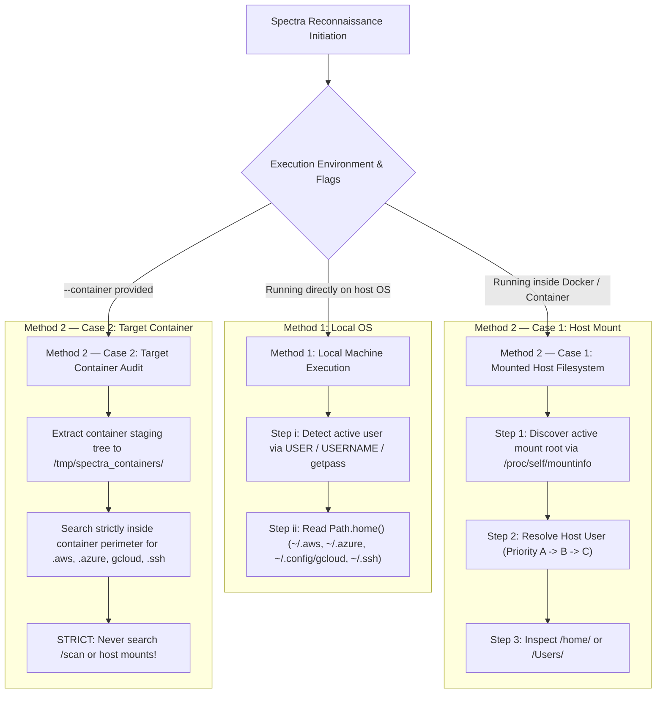

# Spectra Infrastructure & Cloud Cryptographic Scanning Architecture

The `spectra.scanners.infrastructure` package coordinates cryptographic discovery and post-quantum readiness auditing across cloud key management services (AWS KMS, Azure Key Vault, Google Cloud KMS), Infrastructure-as-Code (Terraform, CloudFormation, Kubernetes), and host cryptographic hardware (TPMs, HSMs, CPU acceleration).

---

## 1. Cloud Credential Discovery Engine (`CredentialLocator`)

Spectra implements a dynamic credential locator engine in `spectra.utils.credential_locator` that resolves credentials across three primary operational modes.



---

## 2. The Three Operational Modes

### Method 1: Local Machine Execution (`python -m spectra.cli scan`)
Used when Spectra is installed directly on the developer or CI/CD machine (Windows, macOS, or Linux).

* **Step (i) — Current User Detection**:
  * **Windows**: Reads `os.environ["USERNAME"]` or calls `getpass.getuser()`.
  * **Linux / macOS**: Reads `os.environ["USER"]`, `os.environ["LOGNAME"]`, or calls `getpass.getuser()`.
* **Step (ii) — User Home Inspection**:
  * Resolves `Path.home()` to locate credentials:
    * **AWS**: `~/.aws/credentials` and `~/.aws/config` (extracts profile and default `region`).
    * **Azure**: `~/.azure/accessTokens.json` and `~/.azure/azureProfile.json` (DualToken auth).
    * **Google Cloud (GCP)**:
      * **Linux / macOS**: `~/.config/gcloud/application_default_credentials.json` (ADC) and `~/.config/gcloud/`.
      * **Windows**: `%APPDATA%\gcloud\application_default_credentials.json` (`C:\Users\<user>\AppData\Roaming\gcloud\`) and `%APPDATA%\gcloud\`.
    * **SSH**: `~/.ssh/` (private keys: `id_rsa`, `id_ed25519`, `id_ecdsa`, etc., ignoring `.pub`).

---

### Method 2 — Case 1: Spectra Container with Host Filesystem Mounted (No `--container`)
Used when running Spectra inside a container (e.g. `spectra:latest`) to audit a host filesystem mounted into the container at an arbitrary path (e.g., `-v /:/scan` or `-v /:/abc`).

* **Step 1 — Identify Active Mount Point from `target_dir`**:
  * Inspects `/proc/self/mountinfo` inside the Linux container kernel namespace.
  * Performs longest-prefix matching against `target_dir` (`target_dir.relative_to(mount_point)`) to dynamically detect whether the active mount is `/scan`, `/abc`, `/host`, or `/target`.
  * Fallback heuristic: extracts the top-level path segment (e.g. `/abc/...` $\rightarrow$ `/abc`).
* **Step 2 — Determine Host User**:
  * **Priority A (Explicit CLI flag / env var)**:
    * User passes `docker run -e HOST_USER=$USER ...` (also accepts `WSL_USER` or `SUDO_USER`).
    * Spectra matches this name directly against `<mount>/home/<user>` or `<mount>/Users/<user>`.
  * **Priority B (Target Directory Extraction)**:
    * If `HOST_USER` was omitted, Spectra extracts user path components from `target_dir` (e.g. `/abc/home/ArneshArchWSL/...` $\rightarrow$ detects `ArneshArchWSL`).
  * **Priority C (Smart Auto-Detection)**:
    * If neither was provided, Spectra auto-detects from the mounted filesystem:
      1. Reads `<mount>/etc/wsl.conf` to parse `[user] default = <user>`.
      2. Reads `<mount>/etc/passwd` to locate the standard primary interactive user (UID 1000).
      3. Activity timestamp heuristics: checks modification times of `.bash_history`, `.zsh_history`, or `NTUSER.DAT`.
* **Step 3 — Inspect User Home on Mounted Host**:
  * Navigates directly to that user's home on the mounted drive:
    * **Linux / WSL**: `<mount>/home/<user>/`
    * **Windows**: `<mount>/Users/<user>/`
  * Discovers `.aws`, `.azure`, GCP (`.config/gcloud` or `AppData/Roaming/gcloud`), and `.ssh`.
  * Automatically exports `AWS_SHARED_CREDENTIALS_FILE`, `AWS_CONFIG_FILE`, `AZURE_CONFIG_DIR`, `GOOGLE_APPLICATION_CREDENTIALS`, and `CLOUDSDK_CONFIG` into Spectra's execution environment.

---

### Method 2 — Case 2: Auditing Another Container (`--container` flag passed)
Used when auditing a target container (e.g., `spectra scan --container arnesh512/nexis:latest`).

* **Strict Perimeter Isolation**:
  * **Guaranteed Isolation**: Spectra **never** searches `/scan`, `/host`, or any host mounted directories in this mode. Developer host credentials will never be attributed to the audited application container.
* **Exact Folder & File Names Discovered**:
  * **AWS**: `.aws/` (reads `credentials` and `config`)
  * **Azure**: `.azure/` (reads `accessTokens.json` and `azureProfile.json`)
  * **GCP**:
    * **Config Directory**: `.config/gcloud/` or any directory named `gcloud/`
    * **Credentials File**: `application_default_credentials.json` (Application Default Credentials)
  * **SSH**: `.ssh/` (private keys: `id_rsa`, `id_ed25519`, `id_ecdsa`, etc.)
* **Container Search Strategy**:
  1. **Direct Fast-Path**: Inspects standard container home paths: `/root`, `/home/*`, and the container's configured `WORKDIR`.
  2. **Recursive Bounded Walk**: If any credentials remain undiscovered, performs an `os.walk` strictly inside the target container's extracted staging directory (`/tmp/spectra_containers/<name>/`) or container PID tree `/proc/<pid>/root/` (pruning virtual device nodes `proc`, `sys`, `dev`, `run`, `.git`).
  * Total search time is **under 50 milliseconds**.

---

## 3. Deep-Dive Q&A: WSL, Cross-Mount, and Filesystem Interactions

### Q1: If WSL is mounted, in WSL `/mnt/c` has C: drive mounted. If the user is of WSL, will it scan C: drive? And if the user is of Windows, will it scan C: drive mounted in WSL which is mounted in container?

* **If the user is a WSL user (e.g., `ArneshArchWSL`)**:
  * **No, it will NOT scan C: drive.**
  * When whole WSL is mounted (`docker run -v /:/scan`), the active mount root is `/scan`. Spectra identifies this as Linux via `/scan/home` and `/scan/etc/wsl.conf`. It locates the WSL user's home directly at `/scan/home/ArneshArchWSL/`. It finds `.aws`, `.azure`, `.config/gcloud`, and `.ssh` right there inside the WSL filesystem and stops there. It never enters `/scan/mnt/c`.
* **If the user is a Windows user (e.g., `Arnesh`)**:
  * **When whole WSL is mounted (`-v /:/scan`)**:
    * Spectra checks `<mount>/home` (Linux) and `<mount>/Users` (Windows/Mac). In a whole-WSL mount, Windows users live nested at `/scan/mnt/c/Users`, **not** at the top-level `/scan/Users`.
    * Therefore, if whole WSL is mounted at `/scan`, Spectra's user enumeration only sees `/scan/home/ArneshArchWSL` and `/scan/root`. It will **not** automatically descend into `/scan/mnt/c/Users` looking for Windows users.
  * **When C: drive is mounted directly via WSL (`-v /mnt/c:/scan`)**:
    * The mount root `/scan` directly contains `/scan/Users`. Spectra detects this as Windows, lists the Windows users (`Arnesh`), and scans `/scan/Users/Arnesh/`.

---

### Q2: In Priority B of Step 2, will it auto-detect user from `target_dir` if `target_dir` belongs to Linux, Windows, Mac, WSL, or Windows mounted in WSL?

Priority B checks whether `target_dir` is inside or matches any user directory discovered by `detect_os_and_users(active_mount)`:

| Environment of `target_dir` | Example `target_dir` | Auto-detected? | Reason & Behavior |
| :--- | :--- | :--- | :--- |
| **Native Linux** | `/scan/home/ubuntu/repo` | **Yes** | `<mount>/home/ubuntu` is in `user_list`. Matches `ubuntu`. |
| **WSL Native** | `/scan/home/ArneshArchWSL/proj` | **Yes** | `<mount>/home/ArneshArchWSL` is in `user_list`. Matches `ArneshArchWSL`. |
| **Native macOS** | `/scan/Users/john/repo` | **Yes** | `<mount>/Users/john` is in `user_list`. Matches `john`. |
| **Windows Native** (C: mounted as root) | `/scan/Users/Arnesh/proj` | **Yes** | `<mount>/Users/Arnesh` is in `user_list`. Matches `Arnesh`. |
| **Windows mounted in WSL** (When whole WSL is `-v /:/scan`) | `/scan/mnt/c/Users/Arnesh/proj` | **No** (falls back to WSL default) | In a whole-WSL mount, `user_list` only discovers top-level users in `/scan/home` (`ArneshArchWSL`). `Arnesh` from nested `/mnt/c/Users` is not in `user_list`, so Priority B falls back to the default WSL user in Priority C. |
| **Windows mounted in WSL** (When C: is `-v /mnt/c:/scan`) | `/scan/Users/Arnesh/proj` | **Yes** | `/scan/Users/Arnesh` is top-level on the mount and matches `Arnesh`. |

---

### Q3: In Priority C of Step 2, will auto-detect mounted filesystem (like if user gave `/mnt/c` that is Windows mounted in WSL) check in WSL or C: drive mounted? Also will it work for native Linux, Mac, Windows?

* **If user mounted `/mnt/c` directly (`docker run -v /mnt/c:/scan ...`)**:
  * It will check the **C: drive mounted**, NOT WSL.
  * **Why**: The mount root `/scan` is the C: drive root. It contains `/scan/Users` and `/scan/Windows`. It does **not** contain `/scan/etc/wsl.conf` or `/scan/etc/passwd`. Therefore, WSL checks are skipped, and Priority C executes the Windows activity check (reading `NTUSER.DAT` timestamps across `/scan/Users/*`) to select the active Windows user.
* **If user mounted whole WSL (`docker run -v /:/scan ...`)**:
  * It will check in **WSL**, NOT C: drive, because it finds `/scan/etc/wsl.conf` (`default=ArneshArchWSL`) and `/scan/etc/passwd` (UID 1000).
* **Does Priority C work across all operating systems?**
  * **Native Linux**: **Yes** — Detects UID 1000 in `/etc/passwd` or checks `.bash_history` / `.profile` mtimes.
  * **Native macOS**: **Yes** — Detects `/Users/<user>` and checks `.zsh_history` / `.bash_history` mtimes.
  * **Native Windows**: **Yes** — Detects `C:\Users\<user>` and checks `NTUSER.DAT` mtimes.

---

### Q4: In Step 3, if Windows is mounted in WSL, will it correctly inspect Windows in WSL or will it inspect WSL?

* **If whole WSL was mounted (`-v /:/scan`)**:
  * It will inspect **WSL** (`/scan/home/ArneshArchWSL/`).
  * Discovers:
    * `/scan/home/ArneshArchWSL/.aws`
    * `/scan/home/ArneshArchWSL/.azure`
    * `/scan/home/ArneshArchWSL/.config/gcloud`
    * `/scan/home/ArneshArchWSL/.ssh`
  * It will **not** inspect Windows because the resolved user is the WSL Linux user.
* **If Windows C: was mounted (`-v /mnt/c:/scan`)**:
  * It will inspect **Windows in WSL** (`/scan/Users/Arnesh/`).
  * Discovers:
    * `/scan/Users/Arnesh/.aws`
    * `/scan/Users/Arnesh/.azure`
    * `/scan/Users/Arnesh/AppData/Roaming/gcloud`
    * `/scan/Users/Arnesh/.ssh`

---

## 4. Live Cloud Scanners & Authentication Mechanics

### AWS Scanner (`aws_scanner.py`)
* Uses `boto3` to audit **AWS KMS** Customer Master Keys (CMKs) and **ACM** X.509 Certificates.
* **Dynamic Region Resolution**: Automatically parses `region = <region_name>` from `~/.aws/config` (or the mounted host config file) and prioritizes that region before falling back to default regions (e.g. `us-east-1`).

### Azure Scanner (`azure_scanner.py`)
* **Dual-Tier Authentication Hierarchy**:
  1. **Dynamic CLI Resolution (`AzureCliCredential`)**: If the Azure CLI (`az`) is installed on the host system, Spectra invokes `AzureCliCredential`. It automatically refreshes short-lived OAuth2 access tokens using MSAL's encrypted persistent cache (`msal_token_cache.bin`), eliminating expired token failures on Windows, macOS, or Linux hosts.
  2. **Static Token Resolution (`DualTokenCredential`)**: If `az` CLI is not installed (e.g. inside a stripped-down Linux Docker container), Spectra parses `accessTokens.json` and subscription metadata from `azureProfile.json`.
* **Automatic Expiration Fallback**: If a static token in `accessTokens.json` has expired (`ExpiredAuthenticationToken`), the scanner gracefully falls back to `AzureCliCredential` before querying Key Vaults.
* **Zero Dependency on `az` CLI in Containers**: Operates directly against Azure Resource Manager (ARM) and Azure Key Vault REST APIs without requiring the Azure CLI binary or Windows DPAPI inside Linux containers.

### Google Cloud Scanner (`gcp_scanner.py`)
* Discovers Application Default Credentials (ADC) at `~/.config/gcloud/application_default_credentials.json` (or `%APPDATA%\gcloud\application_default_credentials.json`).
* **OAuth2 Token Exchange**: Exchanges the refresh token directly with `https://oauth2.googleapis.com/token` to obtain an ephemeral access token.
* **Direct REST API Client**: Queries the Google Cloud KMS REST API (`v1/projects/{project}/locations/{location}/keyRings`) directly via HTTPS requests, completely eliminating the need for the `gcloud` CLI binary inside containers.

---

## 5. Usage & Test Reference Commands

### Test Method 1 (Local Host Scan)
```bash
python -m spectra.cli scan . --yes
```

### Test Method 2 — Case 1 (WSL Host Mount in Docker)
```bash
docker run --rm -it \
  -e HOST_USER=$USER \
  -v /:/scan \
  -v /var/run/docker.sock:/var/run/docker.sock \
  -v /mnt/c/Users/Arnesh/spectra:/app/spectra \
  spectra:latest scan /scan/home/ArneshArchWSL/nexis-core-platform --yes
```

### Test Method 2 — Case 1 (Windows C: Mount in Docker)
```bash
docker run --rm -it \
  -v /mnt/c:/scan \
  -v /var/run/docker.sock:/var/run/docker.sock \
  -v /mnt/c/Users/Arnesh/spectra:/app/spectra \
  spectra:latest scan /scan/Users/Arnesh/Desktop/nexis-core-platform --yes
```

### Test Method 2 — Case 2 (Target Container Audit)
```bash
docker run --rm -it \
  -v /var/run/docker.sock:/var/run/docker.sock \
  -v /mnt/c/Users/Arnesh/spectra:/app/spectra \
  spectra:latest scan --container arnesh512/nexis:latest --yes
```
